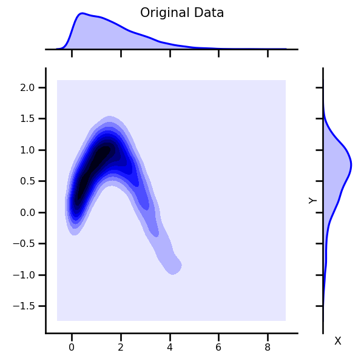
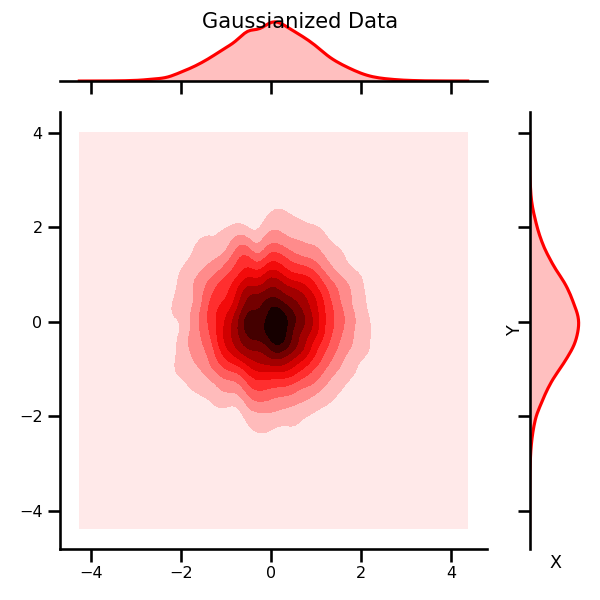
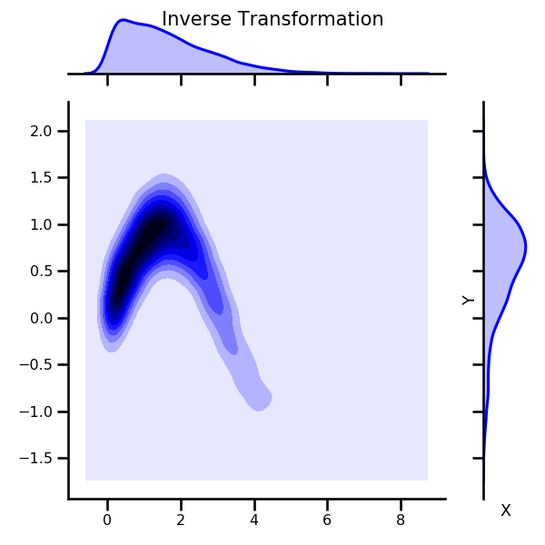
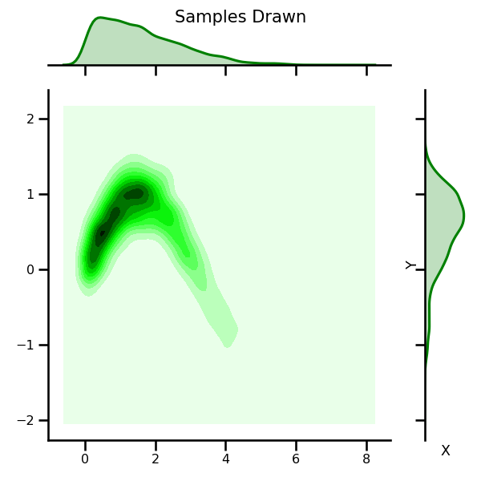
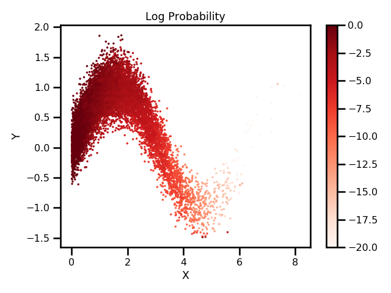

# RBIG using Jax

This package implements the Rotation-Based Iterative Gaussianization (RBIG) algorithm using Jax. It is a normalizing flow algorithm that can transform any multi-dimensional distribution into a Gaussian distribution using a sequence of simple marginal Gaussianization transforms (e.g. histogram) and rotations (e.g. PCA). It is invertible which means you can calculate probabilities as well as sample from your distribution. Seen the example below for details.


|          Original Data           |        Gaussian Transform        |        Inverse Transform        |
| :------------------------------: | :------------------------------: | :-----------------------------: |
|  |  |  |

|          Samples Drawn          |         Probabilities         |
| :-----------------------------: | :---------------------------: |
|  |  |

### Why Jax?

Mainly because I wanted to practice. It's an iterative scheme so perhaps Jax isn't the best for this. But I would like to improve my functional programming skills. In addition, Jax is much faster because of the jit compilation and autobatching. So it handles some difficult aspects of programming a lot easier. Also, the same code can be used for CPU, GPU and TPU with only minor changes. Overall, I didn't see any downside to having some free speed-ups.

---

## Installation Instructions

This repo uses the most updated `jax` library on github so this is absolutely essential, e.g. it uses the latest `np.interp` function which isn't on the `pip` distribution yet. The `environment.yml` file will have the most updated distribution.

1. Clone the repository.

```bash
git clone https://github.com/jejjohnson/rbig_jax
```

2. Install using conda.

```bash
conda env create -f environment.yml
```

3. If you already have the environment installed, you can update it.

```bash
conda activate jaxrbig
conda env update --file environment.yml
```

---

### Resources

* Python Code - [github](https://github.com/jejjohnson/rbig)
* RBIG applied to Earth Observation Data - [github](https://github.com/jejjohnson/rbig_eo)
* Original Webpage - [ISP](http://isp.uv.es/rbig.html)
* Original MATLAB Code - [webpage](http://isp.uv.es/code/featureextraction/RBIG_toolbox.zip)
* Original Python Code - [github](https://github.com/spencerkent/pyRBIG)
* [Paper](https://arxiv.org/abs/1602.00229) - Iterative Gaussianization: from ICA to Random Rotations